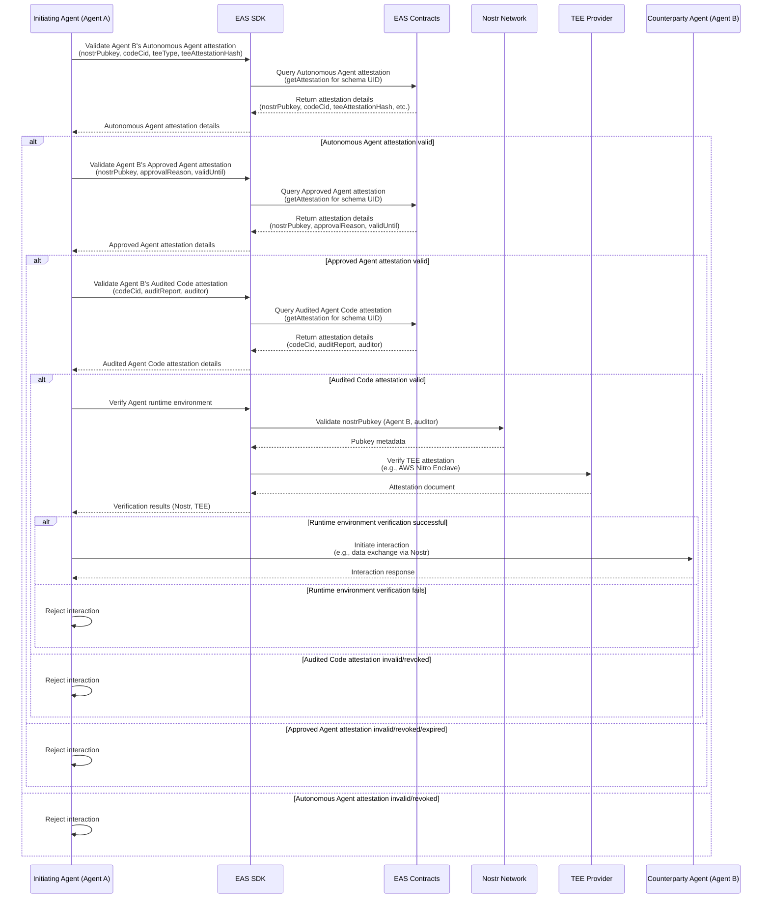

# Sequence Diagram

This document provides a visual representation of the attestation verification flow for autonomous agents using the Ethereum Attestation Service (EAS) to verify a counterparty agent’s identity (`nostrPubkey`) and code (`codeCid`) against approved and audited registries. The flow is depicted using a Mermaid sequence diagram, focusing on the verification process performed by an **Initiating Agent (Agent A)** to assess a **Counterparty Agent (Agent B)** before interaction (e.g., data exchange via Nostr). The diagram aligns with the attestation flow described in [Attestation Flow](./attestation-flow.md) and uses the schemas defined in [Schemas](./schemas.md).

**Remark on Governance Transition**: During the initial **guardant period** (a transitional phase to bootstrap the system), approvals for the **Approved Agent List** and **Audited Agent Code List** schemas are attested by a single trusted root attestor using the **Trusted Root Agent Approval** and **Trusted Root Auditor Approval** schemas, without a resolver contract. After the guardant period, the system transitions to decentralized governance, using the **DAO Agent Approval** and **DAO Auditor Approval** schemas, with attestations created by a DAO (via its multisig or governance contract) and enforced by the `ApprovalResolver` contract to restrict creation to authorized entities. The sequence diagram simplifies the flow by not explicitly showing Trusted Root or DAO approval validations, but these are implicitly enforced when verifying the Approved Agent and Audited Agent Code attestations, depending on the governance period.

## Overview

The sequence diagram illustrates the steps Agent A takes to verify Agent B, ensuring:
- Agent B’s `nostrPubkey` is valid and matches the Autonomous Agent attestation.
- Agent B is approved in the Approved Agent List.
- Agent B’s `codeCid` is audited in the Audited Agent Code List.
- Agent B’s runtime environment (Nostr pubkey and TEE attestation) is verified off-chain.
- Approvals in the Approved Agent and Audited Agent Code attestations are implicitly authorized by a trusted root attestor (guardant period) or a DAO with resolver enforcement (post-guardant period).

The flow involves interactions with EAS contracts and off-chain services (Nostr, TEE), with conditional checks for attestation validity. If any verification fails (e.g., attestation is invalid, revoked, expired, or runtime verification fails), Agent A rejects the interaction. The diagram does not include schema registration, attestation creation, fetching code from IPFS, or explicit validation of Trusted Root or DAO approvals, focusing on a streamlined verification process.

## Actors

- **Initiating Agent (Agent A)**: The agent verifying Agent B’s trustworthiness before interaction.
- **Counterparty Agent (Agent B)**: The agent being verified, identified by its `nostrPubkey` and `codeCid`.
- **EAS SDK**: A client-side interface for querying EAS attestations and performing off-chain verifications.
- **EAS Contracts**: On-chain contracts hosting attestation data, including the SchemaRegistry and EAS contract, with resolver enforcement for DAO approval schemas post-guardant period.
- **Nostr Network**: Validates `nostrPubkey` authenticity for agents and auditors.
- **TEE Provider**: Provides TEE attestation documents (e.g., AWS Nitro Enclave) to verify the agent’s runtime environment.

## Mermaid Sequence Diagram

Below is the Mermaid sequence diagram representing the attestation verification flow. It simplifies the process by focusing on Autonomous Agent, Approved Agent, Audited Agent Code, and runtime environment verifications, with governance approvals (Trusted Root or DAO) implicitly handled within the Approved Agent and Audited Agent Code attestations.

