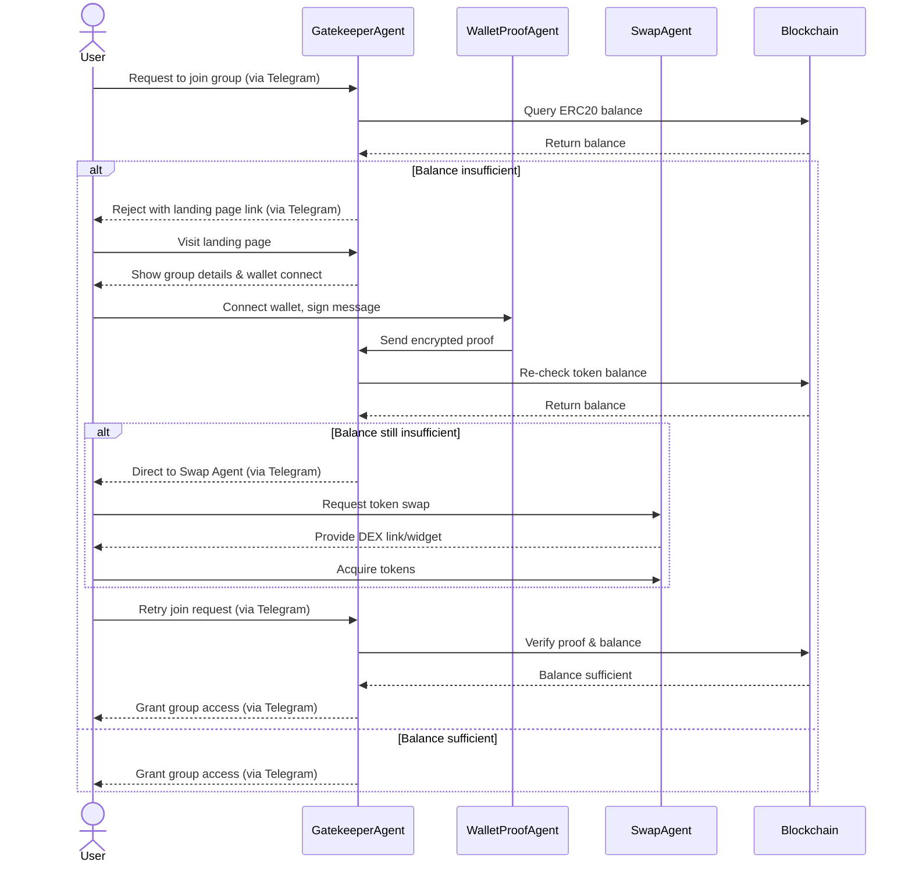

# Use Case: Gated Telegram Community Access via TrustRoot Decentralized Agents Protocol

## Use Case ID
TR-UC-001

## Use Case Name
Gated Telegram Community Access

## Description
This use case describes how a user joins a gated Telegram community using the TrustRoot decentralized agents protocol. The protocol defines interactions between decentralized agents (Gatekeeper Agent, Wallet Proof Agent, Swap Agent) and users to verify ERC20 token ownership and facilitate group access based on predefined policies. The Gatekeeper Agent also provides Telegram bot functionality for user communication.

## Actors
- **User**: An individual seeking to join the Telegram community.
- **Gatekeeper Agent**: A decentralized agent that enforces group policies, manages access, and provides Telegram bot functionality for user communication.
- **Wallet Proof Agent**: A decentralized agent that verifies wallet ownership via signed messages.
- **Swap Agent**: A decentralized agent that assists users in acquiring required tokens.

## Preconditions
- The Telegram community has a defined policy (e.g., hold 100 XYZ tokens).
- The user has an EVM-compatible wallet (e.g., MetaMask).
- TrustRoot agents (Gatekeeper, Wallet Proof, Swap) are deployed and interoperable per the TrustRoot protocol.
- The Gatekeeper Agent is configured to handle Telegram bot interactions.

## Postconditions
- If the user meets the policy, they are granted access to the Telegram community.
- If the user does not meet the policy, they are guided to acquire tokens and retry.

## Basic Flow
1. **User Requests Access**: The user clicks an invite link to join the Telegram community, interacting with the Gatekeeper Agent via its Telegram bot interface.
2. **Policy Check**: The Gatekeeper Agent queries the user’s ERC20 token balance (via the TrustRoot protocol’s agent-to-blockchain interaction) against the group’s policy.
3. **Insufficient Balance Handling**:
   - If the balance is insufficient, the Gatekeeper Agent rejects the request and sends a message (via its Telegram bot interface) with a link to its landing page.
4. **Landing Page Guidance**: The landing page, hosted by the Gatekeeper Agent, displays the group’s purpose, token requirements (e.g., “Hold 100 XYZ tokens”), and a wallet connection option.
5. **Wallet Ownership Verification**:
   - The user connects their EVM wallet and signs a message via the Wallet Proof Agent to prove ownership.
   - The Wallet Proof Agent sends the proof to the Gatekeeper Agent, which encrypts and stores it securely (e.g., as a hash to prevent data exposure).
6. **Token Balance Re-Check**:
   - The Gatekeeper Agent re-verifies the user’s token balance.
   - If insufficient, the Gatekeeper Agent directs the user to the Swap Agent, which provides a link or widget to a decentralized exchange (DEX) for token acquisition.
7. **Retry and Access**:
   - The user retries joining the Telegram group via the Gatekeeper Agent’s Telegram bot interface.
   - The Gatekeeper Agent verifies the stored proof and checks the token balance.
   - If the policy is fulfilled, the Gatekeeper Agent grants access to the Telegram group.

## Alternative Flows
- **A1: Wallet Connection Failure**:
  - If the user fails to connect their wallet or sign the message, the Wallet Proof Agent returns an error to the Gatekeeper Agent, which informs the user (via Telegram) to retry or contact support.
- **A2: Token Swap Failure**:
  - If the user cannot acquire tokens via the Swap Agent (e.g., DEX issues), the Gatekeeper Agent provides alternative DEX options or support contact details.

## Exceptions
- **E1: Blockchain Query Failure**: If the Gatekeeper Agent cannot query the blockchain (e.g., RPC node downtime), it informs the user (via Telegram) to try again later.
- **E2: Malicious Proof Attempt**: If the Wallet Proof Agent detects an invalid or replayed signature, the Gatekeeper Agent rejects the request and logs the attempt.

## Assumptions
- The TrustRoot protocol ensures secure, standardized communication between agents (e.g., via signed messages or encrypted Nostr payloads).
- The Gatekeeper Agent’s Telegram bot interface is a trusted channel for agent-to-user communication.
- Users have basic knowledge of EVM wallets and token swapping.
- Proof expiration is optional and not enforced in this use case.

## Flow Diagram

